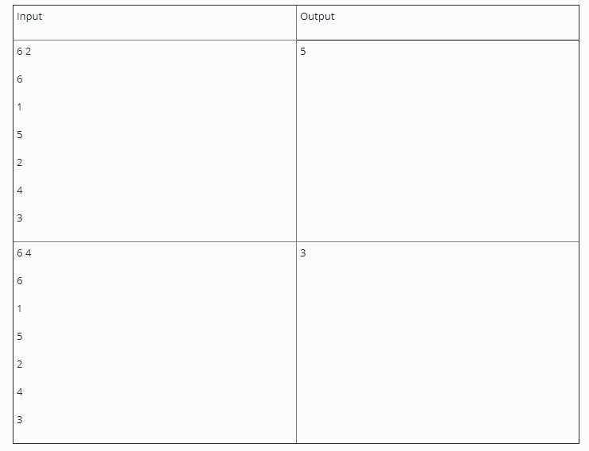
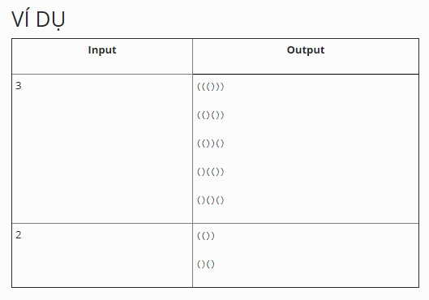

# Phần tử lớn thứ k (quick select)

Cho một mảng số nguyên. Tìm phần tử lớn thứ k trong mảng. Để cho đơn giản ta giả sử mảng không chứa phần tử trùng nhau.

### INPUT

Dòng đầu tiên chứa hai số n và k. Trong đó n là số lượng phần tử trong mảng (n<300.000) và k là thứ hạng cần tìm

n dòng tiếp theo, mỗi dòng chứa một số nguyên dương, đây là các phần tử của mảng.

### OUTPUT
Xuất ra giá trị của phần tử lớn thứ k trong mảng.

LƯU Ý: _Hàm nth_element của C++ bị cấm vì có hàm này rồi thì hông còn gì để làm._

### VÍ DỤ

----------------
---------------

# Tạo cây cân bằng hoàn hảo từ sorted list (pefect_balance_tree)

Cho một mảng đã sắp xếp, hãy tạo cây nhị phân tìm kiếm cân bằng một cách hoàn hảo từ mảng trên.

### INPUT

Một dãy số nguyên đã sắp xếp tăng dần. Mỗi số trên một hàng, input kết thúc bằng ký tự EOF

### OUTPUT
Kết quả khi duyệt cây đã tạo theo thứ tự post-order LRN

### VÍ DỤ

-----------
-----------------

# Đếm tiền (money cal)
 

ATM đang dần trở thành một phần thiết yếu của cuộc sống khi các doanh nghiệp đang chuyển hoàn toàn sang việc trả lương thông qua tài khoản ngân hàng. Một trong những tác vụ chính của ATM là tính toán để có thể lấy ra một lượng tiền chính xác như yêu cầu vào giao cho người sử dụng.

Hộc tiền của ATM được phân thành nhiều ngăn với mỗi ngăn chứa tiền với mệnh giá khác nhau. Hiện nay hầu hết các ATM chúng ta có thể thấy tiền với những mệnh giá: 500.000đ, 200.000đ, 100.000đ, 50.000đ, 20.000đ.

Hãy viết chương trình hỗ trợ ATM tính toán số tiền cần rút.

### INPUT
Một số nguyên dương n với n là bội số của 10.000 và giá trị n không vượt quá mười triệu. Đây là số tiền người sử dụng ATM muốn rút.

### OUTPUT
Hai con số a và b. Trong đó, a là số cách rút tiền mà ATM có thể chọn để đưa cho người dùng và b là số lượng tờ tiền ít nhất mà ATM có thể đưa ra sao cho vẫn vừa đủ số tiền người sử dụng muốn rút. Hai con số trên được xuất trên cùng một hàng, cách nhau bởi 01 khoảng trắng. Nếu số tiền người dùng mong muốn không thể rút được từ các mệnh giá có trong ATM, xuất ra 0 0

### VÍ DỤ

------------------------------
-----------------------
# Goldbach conjecture

Vào những năm 1 nghìn 7 trăm hồi đó. Nhà toán học Goldbach trong lúc gửi thư tâm sự với nhà toán học Euler có đoán đại là có lẽ trên đời này bất cứ cái số chẵn nào lớn hơn hai thì cũng có thể viết thành tổng của 02 số nguyên tố. Nhưng sau đó cả hai nhà toán học đều không chứng minh hay phủ định phỏng đoán trên và đó trở thành một trong những bài toán chưa có lời giải nổi tiếng nhất đến ngày nay.

Bạn Bình cũng muốn tìm được một trường hợp phủ định của phỏng đoán trên để trở nên nổi tiếng. Bình thấy chỉ cần viết một chương trình tìm cách phân tích một số chẵn thành tổng hai số nguyên tố rồi thử từng số nếu tìm ra được số nào không thể phân tích là chắc chắn Bình sẽ giàu to. Bạn hãy giúp Bình viết chương trình trên

### INPUT
Một số chẵn lớn hơn 2

### OUTPUT
Số lượng cách phân tích input thành tổng hai số nguyên tố

### VÍ DỤ

-------
-----------------------
# Dấu ngoặc (bracket)

Phát sinh một chuỗi có n cặp ngoặc đơn lồng nhau theo đúng quy tắc

### INPUT
Số nguyên dương n

### OUTPUT
Một dãy các chuỗi. Mỗi chuỗi chứa chính xác n cặp ngoặc đơn lồng nhau theo đúng quy tắc. Dãy được sắp xếp theo thứ tự từ điền, các chuỗi cách nhau bởi ký tự xuống dòng

### VÍ DỤ

-------------------------
---------------
# Địa chỉ IP

Bạn Bình đi cấu hình mạng cho tiệm net. Bạn ghi tài liệu lại cho chủ tiệm nhưng do dùng phần mềm gõ văn bản quá tốt mà các dấu chấm trong chuỗi ghi địa chỉ IP của các máy bị biến mất hết. Hãy giúp chủ quán đoán tất cả các địa chỉ IP có thể có từ một địa chỉ IP ghi thiếu dấm chấm.

### INPUT

Chuỗi s

### OUTPUT

Ứng với mỗi địa chỉ IP có thể được ghi bởi chuỗi s, xuất địa chỉ IP đó ra trên một dòng. Thứ tự xuất các địa chỉ IP là không quan trọng. hệ thống chấm được hết.

### VÍ DỤ

-----------------
---------------------------
# Chuỗi con

Cho một chuỗi s, hãy tìm tất cả các cách chia chuỗi s thành các chuỗi con sao cho tất cả chuỗi con đều là chuỗi đối xứng (palindrome)

### INPUT
Chuỗi s không chứa khoảng trắng

### OUTPUT
Với mỗi cách chia chuỗi s thành những chuỗi con, xuất ra các chuỗi con này trên cùng một dòng cách nhau bởi khoảng trắng. Các chuỗi con phải được xuất theo đúng thứ tự chúng xuất hiện trong chuỗi s. Thứ tự xuất các cách chia là không quan trọng, hệ thống chấm được hết)

### VÍ DỤ

-----------------
------------------------
# Knight's tour

Viết chương trình tìm lời giải cho bài toán mã đi tuần, bằng phương pháp tìm kiếm theo chiều sâu trên không gian trạng thái (backtracking)

Mỗi trạng thái là danh sách các ô mà mã đã đi qua. Từ một trạng thái, mã có thể thực hiện hành động nhảy đến một ô tiếp theo mà nó chưa đi qua. Các hành động này được đặc trưng bởi chênh lệch tọa độ (cột rồi tới dòng) giữa ô hiện tại mã đang đứng và ô nó sẽ nhảy tới.

Các hành động được phát sinh lần lượt theo thứ tự:  {-1,2}, {1,2}, {2,1}, {2,-1}, {1,-2}, {-1,-2}, {-2, -1}, {-2, 1}. Và do phương pháp tìm kiếm theo chiều sâu thường sử dụng stack nên các trạng thái mới sẽ được xét theo thứ tự ngược với thứ tự phát sinh của chúng.

Chương trình sẽ nhận vào trạng thái ban đầu gồm các thông tin là số dòng, số cột của bàn cờ cùng tọa độ ô đầu tiên mã đang đứng. Và xuất ra màn hình trạng thái kết thúc.

### INPUT
Hàng đầu tiên chứa 02 số nguyên dương: là kích thước bàn cờ

Hàng tiếp theo chứa một chuỗi ghi tọa độ ô đầu tiên mã đang đứng.

### OUTPUT
Danh sách các ô mã sẽ đi qua trong trạng thái kết thúc được tìm ra bởi phương pháp tìm theo chiều sâu.

### VÍ DỤ

----------------
--------------------
# generic hanoi tower

Tháp Hà Nội là một puzzle khá kinh điển, trong đó người chơi có 03 cột để di chuyển các đĩa giữa các cột này. Mỗi lần chỉ được di chuyển 1 dĩa, Mỗi đĩa có kích thước khác nhau và đĩa lớn không được đè lên đĩa nhỏ. Mục đích cuối cùng của puzzle này là xếp hết các đĩa vào trong cột cuối cùng.

Trong trò Tháp Hà Nội gốc, ban đầu tất cả các đĩa nằm ở cột đầu tiên. Tuy nhiên bài toán tháp Hà Nội tổng quát là tìm phương án di chuyển khi các đĩa đang nằm rải rác trên cả 03 cột. Hãy viết chương trình tìm lời giải ngắn nhất cho bài toán tháp Hà nội tổng quát bằng thuật giải tìm kiếm bất kỳ

### INPUT
Input có đúng 03 hàng, biểu diễn cho 03 cột trong trò chơi. Mỗi hàng là một dãy số nguyên, biểu diễn cho các dĩa đang được sắp trên cột. Đỉnh của cột nằm phía bên tay phải.

### OUTPUT
Danh sách các trạng thái từ trạng thái bắt đầu cho tới trạng thái kết thúc. Mỗi trạng thái cách nhau bởi một hàng chỉ chứa dấu hashtag ("#")

### VÍ DỤ

------------------------
----------------

# 8-puzzle
Viết chương trình tìm lời giải cho trường hợp tổng quát của bài toán 8-puzzle - là bài toán n*m-1 puzzle. Bằng phương pháp BACKTRACKING

Tại mỗi trạng thái, các hành động hợp lệ sẽ là swap vị trí của ô số 0 (ô trống) với một ô lân cận với nó (tối đa là 4 ô lân cận). Mỗi hành động được mô tả bằng chênh lệch tọa độ (dòng và cột) giữa ô sẽ bị đổi chỗ trừ cho ô số 0, bao gồm 04 hành động là:  {0, -1}, {1, 0}, {0, +1}, {-1, 0}. Các hành động sẽ được xét theo thứ tự tăng dần.

### INPUT
Dòng đầu tiên chứa hai số nguyên dương n và m.

n dòng tiếp theo mỗi dòng chứa m số. Đây là trạng thái bắt đầu của n*m-1 puzzle

### OUTPUT
Danh sách các trạng thái từ trạng thái bắt đầu đến trạng thái kết thúc chuẩn của n*m-1 puzzle

Cuối mỗi trạng thái cho một dòng chỉ có dấu - để nhận biết.

### VÍ DỤ

----------------------
-----------------
# Anh shipper
Với một cách hiểu đơn giản ta có thể hình dung một đường đi (walk) trên đồ thị là một danh sách có thứ tự các đỉnh trong đó phần tử đầu tiên và phần tử cuối cùng của danh sách là cùng một đỉnh và tồn tại một cạnh nối giữa hai phần tử liên tiếp trong danh sách.

Có một người đưa thư cần tìm đường đi qua tất cả các đỉnh trên đồ thị sao cho mỗi đỉnh chỉ đi duy nhất một lần và trở về vị xuất phát ban đầu. Hãy viết chương trình tìm đường đi đáp ứng yêu cầu đó và có độ dài tối thiểu.

### INPUT

Dòng đầu tiên chứa 2 số e và chuỗi s, đây là số cạnh của đồ thị và tên của đỉnh mà từ đó người đưa thư bắt đầu đi.

e dòng tiếp theo, mỗi dòng chứa 02 chuỗi u, i và số nguyên dương x (cách nhau bởi khoảng trắng), thể hiện việc có một cạnh với độ dài là x nối từ đỉnh u sang đỉnh i trong đồ thị. Tên của các đỉnh chỉ bao gồm các ký tự trong bảng chữ cái.

### OUTPUT:

Xuất ra danh sách các đỉnh trên đường đi cách nhau bởi khoảng trắng.

### VÍ DỤ:

----------------------
-----------------
# 8-puzzle
Viết chương trình tìm lời giải cho trường hợp tổng quát của bài toán 8-puzzle - là bài toán n*m-1 puzzle. Bằng phương pháp BACKTRACKING

Tại mỗi trạng thái, các hành động hợp lệ sẽ là swap vị trí của ô số 0 (ô trống) với một ô lân cận với nó (tối đa là 4 ô lân cận). Mỗi hành động được mô tả bằng chênh lệch tọa độ (dòng và cột) giữa ô sẽ bị đổi chỗ trừ cho ô số 0, bao gồm 04 hành động là:  {0, -1}, {1, 0}, {0, +1}, {-1, 0}. Các hành động sẽ được xét theo thứ tự tăng dần.
### INPUT

Dòng đầu tiên chứa hai số nguyên dương n và m.

n dòng tiếp theo mỗi dòng chứa m số. Đây là trạng thái bắt đầu của n*m-1 puzzle

### OUTPUT:

Danh sách các trạng thái từ trạng thái bắt đầu đến trạng thái kết thúc chuẩn của n*m-1 puzzle

Cuối mỗi trạng thái cho một dòng chỉ có dấu - để nhận biết.

### VÍ DỤ:

-----------------------
----------------
# Bóp bong bóng
Nhân dịp cuối năm, lớp bạn Bình tổ chức chơi trò bóp bong bóng lấy quà. Có một hàng bong bóng được treo trên cao, trong mỗi bong bóng đã có chứa một con số bí ẩn. Khi bóp 1 bong bóng người chơi sẽ nhận được 
l × r × x
 VND, trong đó x là số bí ẩn của bong bóng vừa bị bóp và  l và r là số bí ẩn của bong bóng liền kề bên trái và bên phải (nếu bên phải hoặc trái không còn bóng thì khỏi nhân bóng đó). Bạn Bình do có tay trong nên đã biết hết số bí ẩn của mỗi quả bóng. Hãy tính xem số tiền tối đa Bình có thể thu về là bao nhiêu.

### INPUT
Dòng đầu tiên chứa số n, đây là số lượng bong bóng, n<=20.

n dòng tiếp theo mỗi dòng là một số nguyên. Đây là số bí ẩn của từng quả bóng theo thứ tự.

### OUTPUT
Số tiền tối đa Bình kiếm được.

### VÍ DỤ

------------------------------
---------------------------------------

# Đếm tiền DP-DynamicPrograming
 

ATM đang dần trở thành một phần thiết yếu của cuộc sống khi các doanh nghiệp đang chuyển hoàn toàn sang việc trả lương thông qua tài khoản ngân hàng. Một trong những tác vụ chính của ATM là tính toán để có thể lấy ra một lượng tiền chính xác như yêu cầu vào giao cho người sử dụng.

Hộc tiền của ATM được phân thành nhiều ngăn với mỗi ngăn chứa tiền với mệnh giá khác nhau. Hiện nay hầu hết các ATM chúng ta có thể thấy tiền với những mệnh giá: 500.000đ, 200.000đ, 100.000đ, 50.000đ, 20.000đ.

Hãy viết chương trình hỗ trợ ATM tính toán số tiền cần rút.

### INPUT
Một số nguyên dương n với n là bội số của 10.000 và giá trị n không vượt quá mười triệu. Đây là số tiền người sử dụng ATM muốn rút.

### OUTPUT
Số lượng tờ tiền ít nhất mà ATM có thể đưa ra sao cho vẫn vừa đủ số tiền người sử dụng muốn rút.. Nếu số tiền người dùng mong muốn không thể rút được từ các mệnh giá có trong ATM, xuất ra 0

### VÍ DỤ

M-ATM.jpg

----------------------------------
----------------------------------------------

# Số lượng đường đi ngắn nhất (shortestRoad)

Cho một bảng hình chữ nhật. Trong đó có ô có thể đi vào có ô không thể đi vào. Một robot bắt đầu từ ô ở góc trái trên và muốn di chuyển xuống ô phải dưới. Robot chỉ có thể đi sang phải hoặc đi xuống vì đi bất cứ hướng nào khác sẽ làm đường đi dài thêm.

Hãy tính xem có bao nhiêu cách để robot có thể đến đích.

### INPUT
Dòng đầu tiên là số dòng và số cột của bảng hình chữ nhật.

Các dòng tiếp theo mỗi dòng chứa các số 0 và 1, tượng trưng cho các ô của bảng. Trong đó ô mang số 0 là không thể đi vào được và ô mang số 1 là có thể đi vào.

### OUTPUT
Số cách di chuyển của robot đến ô đích. Nếu có quá nhiều cách thì xuất ra số cách sau khi chia lấy dư cho 1013 + 1

### VÍ DỤ

--------------------
----------------------------

# dãy con đối xứng dài nhất (Palindrome)
Cho một dãy ký tự. Hãy tìm dãy con đối xứng dài nhất của dãy đó.

### INPUT
Một chuỗi ký tự

### OUTPUT
Độ dài của dãy con đối xứng dài nhất

### VÍ DỤ

--------------------
----------------------------

# Bầu cử tổng thống mỹ (america)
Mỹ có cái luật bầu cử rất là dị. Dân không trực tiếp bầu ra tổng thống mà các Đại cử tri của mỗi bang cử ra sẽ bầu ra tổng thống. Dĩ nhiên để chiều lòng dân thì các Đại cử tri này sẽ cam kết, thề thốt và hứa hẹn là nếu đa số cử tri phổ thông trong bang bầu cho ứng viên tổng thống nào thì tất cả đại cử tri của bang cũng bầu cho cùng ứng viên đó.

Điều này nghe thì vui nhưng do các bố trí số đại cử tri và số cử tri phổ thông của các bang không đều nhau nên dẫn đến nếu ứng cử viên thắng cực kỳ sít sao ở vài bang nào đó sẽ đắc cử tổng thống, dù ông ta thua sạch bách không được phiếu cử tri phổ thông nào ở các bang còn lại.

### INPUT
Dòng đầu tiên chứa số n, là số lượng bang ở năm diễn ra bầu cử đó.

n dòng tiếp theo chứa 03 thông tin cách nhau bởi khoảng trắng lần lượt là: tên viết tắt của bang, số phiếu đại cử tri của bang và số phiếu cử tri phổ thông của bang đó.

### OUTPUT
Số phiếu cử tri phổ thông tối thiểu cần phải thắng để trở thành tổng thống Mỹ.

### VÍ DỤ

---------------
------------------------
# Đường đi ngắn nhất nhiều tiền nhất
Cho một bảng hình chữ nhật. Trong đó có ô mang một giá trị nhất định. Một robot bắt đầu từ ô ở góc trái trên và muốn di chuyển nhanh nhất xuống ô phải dưới. Robot chỉ có thể đi sang phải hoặc đi xuống vì đi bất cứ hướng nào khác sẽ làm đường đi dài thêm.

Hãy tính xem đường đi mang lại tổng giá trị lớn nhất của các ô là bao nhiêu?

### INPUT
Dòng đầu tiên là số dòng và số cột của bảng hình chữ nhật.

Các dòng tiếp theo mỗi dòng chứa các số nguyên dương và só 0, tượng trưng cho các ô của bảng. Trong đó ô mang số 0 là không thể đi vào được và ô mang số nguyên dương là giá trị của ô đó

### OUTPUT
Giá trị lớn nhất thu được.

### VÍ DỤ

---------
---------------------

# Bầu cử Mỹ, traceback
Mỹ có cái luật bầu cử rất là dị. Dân không trực tiếp bầu ra tổng thống mà các Đại cử tri của mỗi bang cử ra sẽ bầu ra tổng thống. Dĩ nhiên để chiều lòng dân thì các Đại cử tri này sẽ cam kết, thề thốt và hứa hẹn là nếu đa số cử tri phổ thông trong bang bầu cho ứng viên tổng thống nào thì tất cả đại cử tri của bang cũng bầu cho cùng ứng viên đó.

Điều này nghe thì vui nhưng do các bố trí số đại cử tri và số cử tri phổ thông của các bang không đều nhau nên dẫn đến nếu ứng cử viên thắng cực kỳ sít sao ở vài bang nào đó sẽ đắc cử tổng thống, dù ông ta thua sạch bách không được phiếu cử tri phổ thông nào ở các bang còn lại.

### INPUT
Dòng đầu tiên chứa số n, là số lượng bang ở năm diễn ra bầu cử đó.

n dòng tiếp theo chứa 03 thông tin cách nhau bởi khoảng trắng lần lượt là: tên viết tắt của bang, số phiếu đại cử tri của bang và số phiếu cử tri phổ thông của bang đó.

### OUTPUT
Danh sách các bang cần thắng để thành tổng thống với số phiếu cử tri phổ thông tối thiểu. Nếu có nhiều danh sách có cùng số phiếu cử tri phổ thông tối thiểu, xuất cái nào cũng được.

### VÍ DỤ   

---------------
------------------------
# Đường đi ngắn nhất nhiều tiền nhất, traceback
Cho một bảng hình chữ nhật. Trong đó có ô mang một giá trị nhất định. Một robot bắt đầu từ ô ở góc trái trên và muốn di chuyển xuống ô phải dưới. Robot chỉ có thể đi sang phải hoặc đi xuống vì đi bất cứ hướng nào khác sẽ làm đường đi dài thêm.

Hãy tính xem đường đi mang lại tổng giá trị lớn nhất của các ô là bao nhiêu?

### INPUT
Dòng đầu tiên là số dòng và số cột của bảng hình chữ nhật.

Các dòng tiếp theo mỗi dòng chứa các số 0 và 1, tượng trưng cho các ô của bảng. Trong đó ô mang số 0 là không thể đi vào được và ô mang số 1 là có thể đi vào.

### OUTPUT
Giá trị lớn nhất thu được khi đến đích và một trong các đường đi để thu được giá trị đó. Đường đi được xuất với tọa độ mỗi ô trên một dòng, truy ngược từ ô đích lên ô bắt đầu.

### VÍ DỤ

