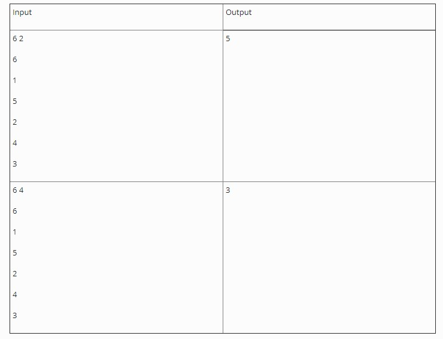

## Phần tử lớn thứ k (quick select)

Cho một mảng số nguyên. Tìm phần tử lớn thứ k trong mảng. Để cho đơn giản ta giả sử mảng không chứa phần tử trùng nhau.

# INPUT

Dòng đầu tiên chứa hai số n và k. Trong đó n là số lượng phần tử trong mảng (n<300.000) và k là thứ hạng cần tìm

n dòng tiếp theo, mỗi dòng chứa một số nguyên dương, đây là các phần tử của mảng.

# OUTPUT
Xuất ra giá trị của phần tử lớn thứ k trong mảng.

LƯU Ý: _Hàm nth_element của C++ bị cấm vì có hàm này rồi thì hông còn gì để làm.

# VÍ DỤ

