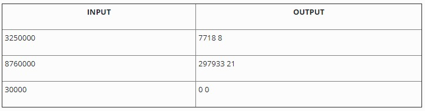

# Phần tử lớn thứ k (quick select)

Cho một mảng số nguyên. Tìm phần tử lớn thứ k trong mảng. Để cho đơn giản ta giả sử mảng không chứa phần tử trùng nhau.

### INPUT

Dòng đầu tiên chứa hai số n và k. Trong đó n là số lượng phần tử trong mảng (n<300.000) và k là thứ hạng cần tìm

n dòng tiếp theo, mỗi dòng chứa một số nguyên dương, đây là các phần tử của mảng.

### OUTPUT
Xuất ra giá trị của phần tử lớn thứ k trong mảng.

LƯU Ý: _Hàm nth_element của C++ bị cấm vì có hàm này rồi thì hông còn gì để làm._

### VÍ DỤ

----------------
---------------

# Tạo cây cân bằng hoàn hảo từ sorted list (pefect_balance_tree)

Cho một mảng đã sắp xếp, hãy tạo cây nhị phân tìm kiếm cân bằng một cách hoàn hảo từ mảng trên.

### INPUT

Một dãy số nguyên đã sắp xếp tăng dần. Mỗi số trên một hàng, input kết thúc bằng ký tự EOF

### OUTPUT
Kết quả khi duyệt cây đã tạo theo thứ tự post-order LRN

### VÍ DỤ

-----------
-----------------

# Đếm tiền (money cal)
 

ATM đang dần trở thành một phần thiết yếu của cuộc sống khi các doanh nghiệp đang chuyển hoàn toàn sang việc trả lương thông qua tài khoản ngân hàng. Một trong những tác vụ chính của ATM là tính toán để có thể lấy ra một lượng tiền chính xác như yêu cầu vào giao cho người sử dụng.

Hộc tiền của ATM được phân thành nhiều ngăn với mỗi ngăn chứa tiền với mệnh giá khác nhau. Hiện nay hầu hết các ATM chúng ta có thể thấy tiền với những mệnh giá: 500.000đ, 200.000đ, 100.000đ, 50.000đ, 20.000đ.

Hãy viết chương trình hỗ trợ ATM tính toán số tiền cần rút.

### INPUT
Một số nguyên dương n với n là bội số của 10.000 và giá trị n không vượt quá mười triệu. Đây là số tiền người sử dụng ATM muốn rút.

### OUTPUT
Hai con số a và b. Trong đó, a là số cách rút tiền mà ATM có thể chọn để đưa cho người dùng và b là số lượng tờ tiền ít nhất mà ATM có thể đưa ra sao cho vẫn vừa đủ số tiền người sử dụng muốn rút. Hai con số trên được xuất trên cùng một hàng, cách nhau bởi 01 khoảng trắng. Nếu số tiền người dùng mong muốn không thể rút được từ các mệnh giá có trong ATM, xuất ra 0 0

### VÍ DỤ

------------------------------
-----------------------
