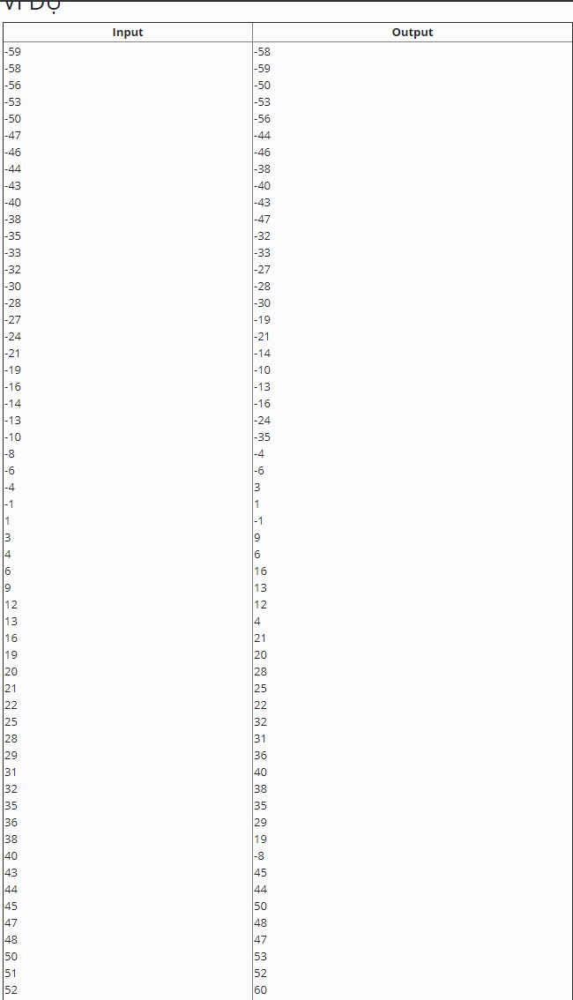

# Phần tử lớn thứ k (quick select)

Cho một mảng số nguyên. Tìm phần tử lớn thứ k trong mảng. Để cho đơn giản ta giả sử mảng không chứa phần tử trùng nhau.

### INPUT

Dòng đầu tiên chứa hai số n và k. Trong đó n là số lượng phần tử trong mảng (n<300.000) và k là thứ hạng cần tìm

n dòng tiếp theo, mỗi dòng chứa một số nguyên dương, đây là các phần tử của mảng.

### OUTPUT
Xuất ra giá trị của phần tử lớn thứ k trong mảng.

LƯU Ý: _Hàm nth_element của C++ bị cấm vì có hàm này rồi thì hông còn gì để làm._

### VÍ DỤ

----------------
---------------

# Tạo cây cân bằng hoàn hảo từ sorted list (pefect_balance_tree)

Cho một mảng đã sắp xếp, hãy tạo cây nhị phân tìm kiếm cân bằng một cách hoàn hảo từ mảng trên.

### INPUT

Một dãy số nguyên đã sắp xếp tăng dần. Mỗi số trên một hàng, input kết thúc bằng ký tự EOF

### OUTPUT
Kết quả khi duyệt cây đã tạo theo thứ tự post-order LRN

### VÍ DỤ

-----------
-----------------
